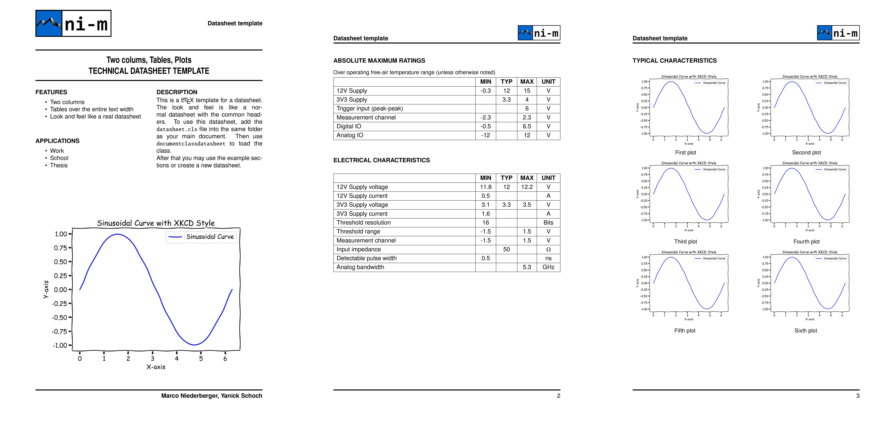

# Latex Datasheet Template

This repo provides a Latex class for a datasheet.
Use the provided [datasheet.cls](datasheet.cls) file as the class for your document.

See [example.tex](example.tex) for a short introduction on how to use the class.
See the release section of this repo for an example pdf.

## Contribution
Feel free to fork and improve this class.
